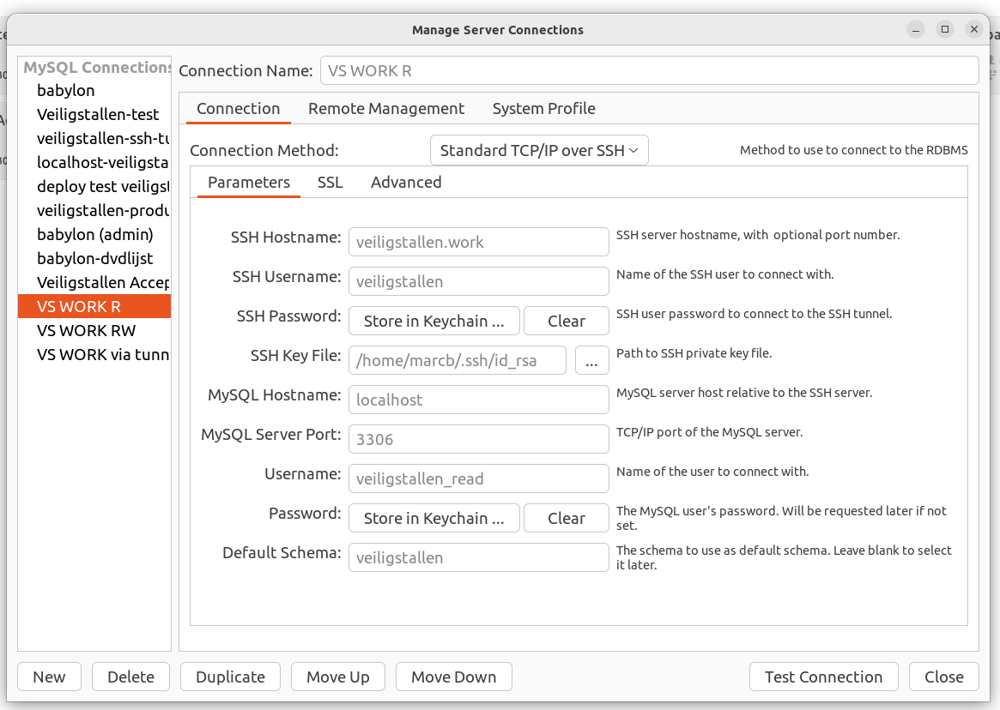
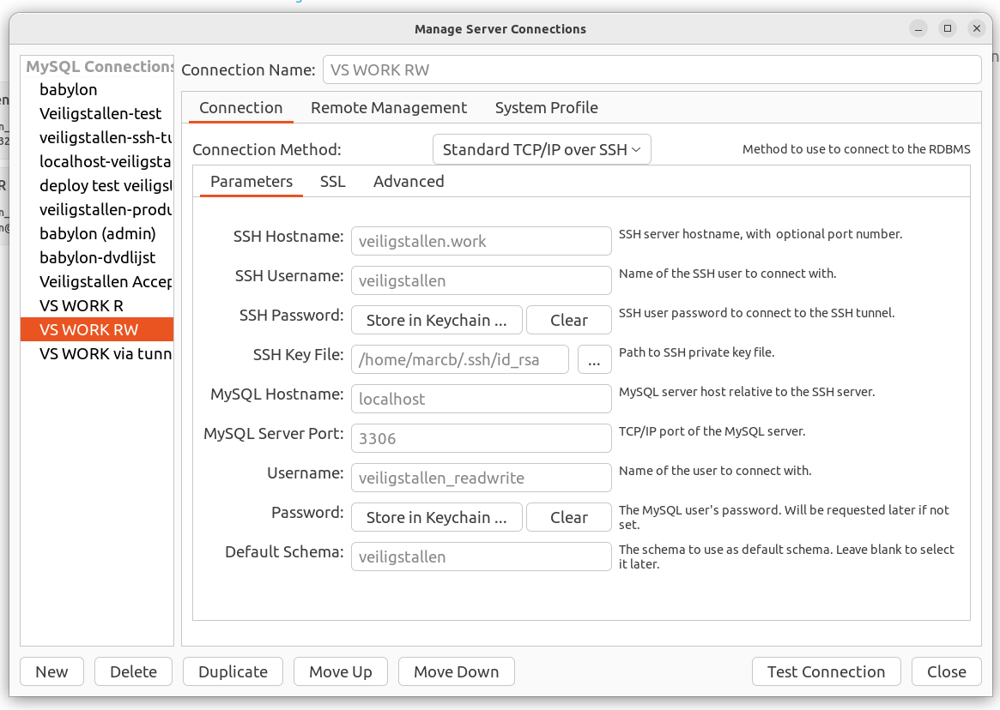
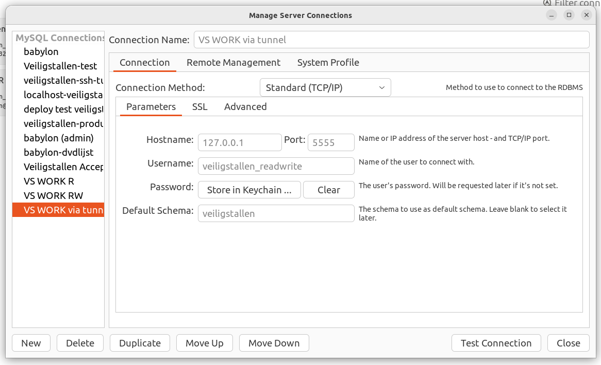

# Remote test database server

For testing, a mysql8 database server has been set up at veiligstallen.work that holds a copy of the production database 

data from production database was last copied on: 4/10/2024

## Veiligstallen.work VPS
The VPS runs on a digital ocean droplet 
* 1 GB Memory / 1 Intel vCPU / 35 GB Disk + 70 GB volume
* AMS3 
* Ubuntu 24.04 (LTS) x64

## Veiligstallen.work VPS access
External access as root user is disabled.
A single sudo user veiligstallen is available for login. VPS access to the droplet is only possible by registering your ssh key for the veiligstallen user.
````
    ssh veiligstallen@veiligstallen.work
````    

## Mysql server access

Two accounts have been set up for accessing the mysql server
* veiligstallen_readonly 
* veiligstallen_readwrite

The production app accesses the database server via its localhost address. For developers access is available by setting up an ssl tunnel and mapping the mysql server port to a local port on the development machine. This requires that your ssh key is registered with the veiligstallen login account.
````
ssh -f -N -L 5555:localhost:3306 veiligstallen@veiligstallen.work
````

This maps the mysql server to port 5555 on the local machine. Now both accounts can be used to access the mysql server

## Setting up MySQL workbench

### Read-only user


### Read-write user


### Via existing SSH tunnel



# Creating the droplet on Digital Ocean

Create a new droplet, boot and login as root user.

````
sudo apt upgrade
sudo apt update
sudo apt install mysql-server
sudo reboot
````

Secure the mysql server

````
sudo mysql_secure_installation 
sudo nano /etc/mysql/mysql.conf.d/mysqld.cnf
````

check bind addresses
````
    bind-address            = 127.0.0.1
    mysqlx-bind-address     = 127.0.0.1
````

Setup global login options
````
sudo nano /etc/ssh/sshd_config
````

Add these settings
````
    PubkeyAuthentication yes
    PasswordAuthentication no
    ChallengeResponseAuthentication no
````

Create sudo user veiligstallen

````
sudo adduser veiligstallen
mkdir -p /home/veiligstallen/.ssh
cd /home/veiligstallen/.ssh
touch ./authorized_keys 
nano ./authorized_keys 
````
Add ssh keys for users with droplot / database access

TODO: in the future, create a separate account for users with database access but no droplet access. 

````
usermod -aG sudo veiligstallen
chmod 600 /home/veiligstallen/.ssh/authorized_keys 
chown veiligstallen:veiligstallen /home/veiligstallen_read/.ssh/

sudo systemctl restart ssh
````

Setup mysql users: login to mysql as root user

````
mysql -u root
````

````
CREATE USER 'veiligstallen_read'@'localhost' IDENTIFIED BY 'xxxxxx';
GRANT SELECT ON veiligstallen.* TO 'veiligstallen_read'@'localhost';

CREATE USER 'veiligstallen_readwrite'@'localhost' IDENTIFIED BY 'xxxxx';
GRANT ALL PRIVILEGES ON veiligstallen.* TO 'veiligstallen_readwrite'@'localhost';

FLUSH PRIVILEGES;

ALTER USER 'veiligstallen_readwrite'@'localhost' IDENTIFIED WITH 'caching_sha2_password' BY 'xxxxx';
FLUSH PRIVILEGES;

exit
````

Test the new mysql accounts

````
mysql -u veiligstallen_readwrite      # should be denied
mysql -u veiligstallen_readwrite -p   # should work with valid password
mysql -u veiligstallen_read           # should be denied
mysql -u veiligstallen_read -p        # should work with valid password
mysql                                 # should work (root user)
mysql -u root                         # should work (root user)
````

## Add external volume to droplet
An external volume has been added to the droplet due to the large database size.
This has been done using the instructions at
* https://www.digitalocean.com/community/tutorials/how-to-move-a-mysql-data-directory-to-a-new-location-on-ubuntu-20-04

Handy: If the volume is resized after being created (for example, the database grows beyond the existing size). After resizing the droplet in the digital ocean dashboard, resize the filesystem with:
````
sudo resize2fs /dev/sda
````

## Backing up the production database

From the project root folder run:

````
bash scripts/backup-production.sh
````

This creates a full copy of the production database in ./mysqldb-productiondata

## Restoring the production database to veiligstallen.work

Enter the database password for the veiligstallen_readwrite user in mysqldb-veiligstallen.work/.env
````
REMOTE_DB_PASSWORD=xxxx
````

From the project root folder run:

````
bash mysqldb-veiligstallen.work/restore-veiligstallenwork.sh
````

Note: The restore script has been set up in such a way that you can also partially restore the database by changing the TABLES_ALL variable. This can be handy when the restore operation fails after a partial restore (restoring takes several hours).

To do this, comment out the **restore_structure** line in the script (as this deletes the entire database), optionally empty the table(s) that did not restore fully with 
````
FLUSH <tablename
````
And update the TABLES_ALL variable to hold only the tables that need to be restored:
````
#TABLES_ALL="....full list..."
TABLES_ALL="transacties emails" 
````

## working on the prisma schema in a structure only database

Create a copy of the database that does not contain any data (for fast delete/restore of the db during development)

set databasename in .env to veiligstallenprisma -> otherwise it will overwrite the test database

(user access has been set-up already for veiligstallenprisma, if you use another database name you will get instructions for setting up the read and readwrite user)

````
bash mysqldb-veiligstallen.work/restore-veiligstallenwork.sh
````

select yes to overwrite/restore structure, no to restore data


## References
* https://www.digitalocean.com/community/tutorials/how-to-install-mysql-on-ubuntu-20-04
* https://www.digitalocean.com/community/tutorials/how-to-move-a-mysql-data-directory-to-a-new-location-on-ubuntu-20-04